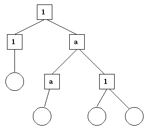
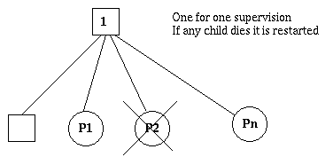
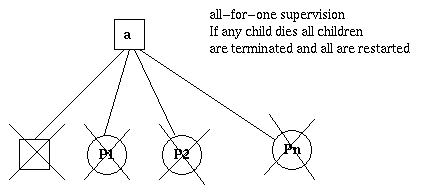

# 1. 概览

OTP设计原则定义怎么使用进程，　模块以及目录来组织Erlang代码

## 1.1 监督树

Erlang中一个基本的概念是监督树，　它是基于工作者进程和监督者进程的进程结构模型:

	* 工作者进程是那些执行计算的进程，　就是说，　它们是真正干活的进程

	*监督者进程是那些监视工作者进程的进程。当工作者进程出错的时候，监督者进程可以对它进行重启

	* 通过监督树可以将工作者进程和监督者进程组织成树状层次结构, 从而使得软件容错成为可能

在下面的图中，　正方形代表监督者进程，　圆形代表工作者进程: 

图1.1 监督树

## 1.2 行为

在监督树中，　在部分进程都有相似的结构，它们遵循类似的模式。比如说，　监督者进程
在结构上是相似的。唯一的不同就是它们所监视的对象。很多的工作者进程故都是客户服务
器中的服务器，　有限状态机，　或错误日志所采用的事件处理器模式。

行为这个名词形式化了这些通用的模式. 我们的意图是将进程的代码划分为通用部分(行为模块)
和专有部分(回调模块).
行为模块是OTP的组成部分.　如果想实现一个监督者进程, 用户只需要实现回调模块即可, 这个
模块需要导出一组预定义的函数集(回调函数)
　
下面的例子展示了怎么将代码分割成通用部分和细节部分. 代码所要实现的功能是一个跟踪信道的
简单服务器. 其他进程可以通过调用alloc/0和free/1来分配是释放信道.

    -module(ch1).
    -export([start/0]).
    -export([alloc/0, free/1]).
    -export([init/0]).

    start() ->
        spawn(ch1, init, []).

    alloc() ->
        ch1 ! {self(), alloc},
        receive
            {ch1, Res} ->
                Res
        end.

    free(Ch) ->
        ch1 ! {free, Ch},
        ok.

    init() ->
        register(ch1, self()),
        Chs = channels(),
        loop(Chs).

    loop(Chs) ->
        receive
            {From, alloc} ->
                {Ch, Chs2} = alloc(Chs),
                From ! {ch1, Ch},
                loop(Chs2);
            {free, Ch} ->
                Chs2 = free(Ch, Chs),
                loop(Chs2)
        end　

我们可以将上面这段代码重写成更通用的部分server.erl

    -module(server).
    -export([start/1]).
    -export([call/2, cast/2]).
    -export([init/1]).

    start(Mod) ->
        spawn(server, init, [Mod]).

    call(Name, Req) ->
        Name ! {call, self(), Req},
        receive
            {Name, Res} ->
                Res
        end.

    cast(Name, Req) ->
        Name ! {cast, Req},
        ok.

    init(Mod) ->
        register(Mod, self()),
        State = Mod:init(),
        loop(Mod, State).

    loop(Mod, State) ->
        receive
            {call, From, Req} ->
                {Res, State2} = Mod:handle_call(Req, State),
                From ! {Mod, Res},
                loop(Mod, State2);
            {cast, Req} ->
                State2 = Mod:handle_cast(Req, State),
                loop(Mod, State2)
        end.

和回调模块ch2.erl:
    -module(ch2).
    -export([start/0]).
    -export([alloc/0, free/1]).
    -export([init/0, handle_call/2, handle_cast/2]).

    start() ->
        server:start(ch2).

    alloc() ->
        server:call(ch2, alloc).

    free(Ch) ->
        server:cast(ch2, {free, Ch}).

    init() ->
        channels().

    handle_call(alloc, Chs) ->
        alloc(Chs). % => {Ch,Chs2}

    handle_cast({free, Ch}, Chs) ->
        free(Ch, Chs). % => Chs2

请注意以下几点:

* server模块的代码可以用来构建很多不同的服务器
* 服务器的名字, 在这里是ch2, 并不被客户端函数知道, 这是一个好的编程习惯.
　　它允许我们在不改变接口的前提下修改协议
* 可以在不改变ch2或其他回调模块的前提下扩展server模块的功能

在上面的ch1.erl和ch2.erl例子中, channels/0, alloc/1, free/2并未实现, 为了完整起见，下面提供这几个函数的实现:

    channels() ->
       {_Allocated = [], _Free = lists:seq(1,100)}.

    alloc({Allocated, [H|T] = _Free}) ->
       {H, {[H|Allocated], T}}.

    free(Ch, {Alloc, Free} = Channels) ->
       case lists:member(Ch, Alloc) of
          true ->
             {lists:delete(Ch, Alloc), [Ch|Free]};
          false ->
             Channels
       end.  

不使用行为模式来编写的代码可能更有效率, 但这是以牺牲通用性为代价的. 能够以一致的方式管理
系统中的应用非常重要. 行为模式使得阅读别人的代码变得更容易. 过于简单的代码结构，虽然可能
带来效率提升，　但通常也更难理解.

OTP提供了以下的行为模式:
* gen_server　　通用服务器
* gen_fsm     有限状态机(旧)
* gen_statem  状态机(新)
* gen_event   事件处理器
* supervisor  实现监控树中的监督者进程

编译器理解模块属性-behaviour(Behaviour)　如果没有提供相应的回调函数, 它将发出警告, 例如:

    -module(chs3).
    -behaviour(gen_server).
    ...
    3> c(chs3).
    ./chs3.erl:10: Warning: undefined call-back function handle_call/3
    {ok,chs3}

## 1.3 应用

OTP自带了很多组件, 每个组件都实现了特定的功能. 组件在OTP中被称为应用. 其中一个例子是Mnesia,
它包含了数据库服务需要的所有东西, 另一个例子是Debugger, 它被用来调试Erlang程序. Erlang最小系统由两个应用组成:

* Kernel - 包含运行Erlang所需要的功能
* STDLIB - Erlang标准库

应用这一概念既表明了程序结构, 也包含了目录结构.
最简单的应用不包含任何进程, 只是由一系列的功能模块组成. 我们称它为库应用. STDLIB就是一个例子
包含进程的应用可以很方便的使用标准的行为模式将其实现为监督树的结构.
怎么对应用进行编程在应用一章中描述.

## 1.4 分发包

版本指的是由OTP应用子集和用户应用组成的完整系统
怎么生成版本在版本一章描述

## 1.5 分发包处理

分发包处理涉及到在分发包不同版本之间进行在线升级和在线降级. 这部分在分发包处理一章描述.

# 2 通用服务器行为模式

请结合gen_serverman手册中的stdlib阅读本章, 那里详细描述了所有的接口函数和回调函数

# 2.1 客户端服务器模型

客户端服务器模型由一个服务器和任意的客户端组成. 我们主要用它进行资源管理操作, 多个客户端
共享一组资源. 服务器则负责管理这组资源.

图2.1: 客户端服务器模型

## 2.2 例子

概览一章中提供了一个客户端服务器的简单例子. 我们将其用通用服务器重新实现后, 其代码如下:

    -module(ch3).
    -behaviour(gen_server).

    -export([start_link/0]).
    -export([alloc/0, free/1]).
    -export([init/1, handle_call/3, handle_cast/2]).

    start_link() ->
        gen_server:start_link({local, ch3}, ch3, [], []).

    alloc() ->
        gen_server:call(ch3, alloc).

    free(Ch) ->
        gen_server:cast(ch3, {free, Ch}).

    init(_Args) ->
        {ok, channels()}.

    handle_call(alloc, _From, Chs) ->
        {Ch, Chs2} = alloc(Chs),
        {reply, Ch, Chs2}.

    handle_cast({free, Ch}, Chs) ->
        Chs2 = free(Ch, Chs),
        {noreply, Chs2}.

我们将在下一节对代码进行解释

## 2.3 启动通用服务器
在上面的例子中, 通用服务器进程是通过调用ch3:start_link()来启动的

    start_link() ->
        gen_server:start_link({local, ch3}, ch3, [], []) => {ok, Pid}

start_link调用了gen_server的start_link/4, 这个函数生成一个新的进程并链接到它上面.

* 第一个参数{local, ch3}指定了服务器的名字, 该服务器进程将会在本地被注册为ch3
  如果我们忽略了名字, 那新的进程将不会被注册。在这种情况下我们只能使用pid来和它进行交互
  我们也可以把名字改为{global, ch3},这样将会调用global:register_name/2进行名字注册
* 第二个参数ch3是回调模块的名字，　也就是回调函数所在的模块。
　　把接口函数和回调函数放到同一个模块是一种好的编程习惯，　这样我们就可以把和一个进程相关的
　　代码都组织在一个模块中
* 第三个参数[]是一个列表，　它会被原封不动的传递给init函数, 这里init不需要
　　任何输入参数, 所以是一个空列表
* 第四个参数[]是一个选项列表, 可以查阅man手册看看有哪些选项可用.

如果名字注册成功, 新的gen_server进程会调用ch3:init([]). init回调将返回{ok,State},State
将会成为新进程的内部状态. 在我们这个例子中，　状态为所有可用的通道.

    init(_Args) ->
        {ok, channels()}.

gen_server:start_link是同步的，　它直到新的进程初始化完成并准备好接受请求才返回.
如果想要新进程成为监控树的一部分，则必须使用gen_server:start_link. 相应的，
gen_server:start则启动一个独立的gen_server.这一点可以在gen_server的源码实现中
体现:

    start(Mod, Args, Options) ->
        gen:start(?MODULE, nolink, Mod, Args, Options).

    start(Name, Mod, Args, Options) ->
        gen:start(?MODULE, nolink, Name, Mod, Args, Options).

    start_link(Mod, Args, Options) ->
        gen:start(?MODULE, link, Mod, Args, Options).

    start_link(Name, Mod, Args, Options) ->
        gen:start(?MODULE, link, Name, Mod, Args, Options).

start传递了nolink标志, 而start_link则传递了link标志

## 2.4 同步请求-call

同步请求alloc使用gen_server:call/2来实现：

    alloc() ->
        gen_server:call(ch3, alloc).

gen_server:call 将会调用gen:call来实现
gen:call首先对进程进行监视, 监视成功后将消息打上标签并调用erlang:send来将打好包的消息
发送给目标进程，　一旦收到目标进程的回复，立即解除监视并返回结果. 如果这期间目标进程死了，
则进行出错处理. 如果超时, 则返回超时
(可实验测试下超时, 和目标进程死掉的情况)

ch3是目标进程的名字, 必须和启动它时传递的名字相同. alloc是真正的请求

请求被转换成一个消息并发送给gen_server进程. 当收到消息后, gen_server进程会调用
handle_call(Request, From, State)来处理该请求，该函数将返回{reply, Reply, State1}
Reply被发送给客户端进程.　State1将会成为进程的新状态

    handle_call(alloc, _From, Chs) ->
        {Ch, Chs2} = alloc(Chs),
        {reply, Ch, Chs2}.

在我们这个例子中, Reply为分配出来的通道, 而新状态为剩下的可用通道.

## 2.5 异步请求- cast

异步请求free(Ch)通过调用gen_server:cast/2来实现:

    free(Ch) ->
        gen_server:cast(ch3, {free, Ch}).

请求被转换成消息发送给目标进程, 然后cast和free就返回ok.

当收到请求后, gen_server进程调用handle_cast(Request, State)进行处理, 该函数返回
{noreply, State1}. State1变成gen_server进程的新状态.

## 2.6 停止进程

如果gen_server进程是监控树的一部分, 则不需要提供任何函数来停止进程. 监控树中的gen_server
进程自动被它的监督者进程终结. 具体是怎么停止的在监督者进程的　进程停止策略中规定

如果进程在停止之前有资源需要清理, 则监督者进程的停止策略必须是一个超时值, 并且必须在init函数
中设置进程捕获退出信号. 当收到停止命令, gen_server进程则调用
回调函数terminate(shutdown, State):

    init(Args) ->
        ...,
        process_flag(trap_exit, true),
        ...,
        {ok, State}.

    ...

    terminate(shutdown, State) ->
        ..code for cleaning up here..
        ok.

## 2.7 处理其他消息

如果想让gen_server进程处理请求以外的消息, 就必须实现handle_info(Info, State)函数.
其中我们需要处理的比较常见的消息是退出消息, 如果gen_server链接到其他进程(非监督者进程), 并且设置了捕获系统消息.那我们就需要handle_info来处理它们:

    handle_info({'EXIT', Pid, Reason}, State) ->
        ..code to handle exits here..
        {noreply, State1}.

同时还需要实现code_change函数:

    code_change(OldVsn, State, Extra) ->
        ..code to convert state (and more) during code change
        {ok, NewState}.

# 3. gen_fsm行为模式

<table>
    <th align="left" bgcolor="#00db00">Note</th>
    <tr>
        <td bgcolor="#6fb7b7">
            有一个新的行为模式gen_statem用来替换gen_fsm，它增添了一些有用的特性,
            但是为了向后兼容, 我们仍然保留gen_fsm行为模式
        </td>
    </tr>
</table>

请结合gen_fsm的man手册阅读本章内容

## 3.1 有限状态机

一个有限状态机可以描述成以下形式:

    State(S) x Event(E) -> Actions(A), State(S') 

上面的公式意思为:
当我们处于状态S的时候， 如果发生了事件E，那我们将执行动作A并装到状态S'.

当使用gen_fsm行为模式时, 状态转换规则由一组Erlang函数组成, 这些函数遵守下面的模式:

    StateName(Event, StateData) ->
        .. code for actions here ...
        {next_state, StateName', StateData'}

这个函数的内涵为当gen_fsm进程处于StateName状态时, 如果来了事件Event, 将执行函数StateName
通过返回值的方式把进程的状态置为StateName'并把状态数据更新为StateData'

## 3.2 例子

    -module(code_lock).
    -behaviour(gen_fsm).

    -export([start_link/1]).
    -export([button/1]).
    -export([init/1, locked/2, open/2]).

    start_link(Code) ->
        gen_fsm:start_link({local, code_lock}, code_lock, lists:reverse(Code), []).

    button(Digit) ->
        gen_fsm:send_event(code_lock, {button, Digit}).

    init(Code) ->
        {ok, locked, {[], Code}}.

    locked({button, Digit}, {SoFar, Code}) ->
        case [Digit|SoFar] of
            Code ->
                do_unlock(),
                {next_state, open, {[], Code}, 30000};
            Incomplete when length(Incomplete)<length(Code) ->
                {next_state, locked, {Incomplete, Code}};
            _Wrong ->
                {next_state, locked, {[], Code}}
        end.

    open(timeout, State) ->
        do_lock(),
        {next_state, locked, State}.

译注: 状态是内置在gen_fsm进程中的, 这里的回调函数的任务是执行动作和状态转换

## 3.3启动gen_fsm进程

上面的例子中, 通过调用code_lock:start_link(Code)来启动一个gen_fsm进程

    start_link(Code) ->
        gen_fsm:start_link({local, code_lock}, code_lock, lists:reverse(Code), []).

start_link调用了gen_fsm的start_link/4来产生并链接到一个新的gen_fsm进程.

函数参数解释(暂时略)

如果名字注册成功, 新的gen_fsm进程将会调用回调函数code_lock:init(Code). 该函数会返回
{ok, StateName, StateData}, StateName会成为新进程的初始状态. 在这个例子中是locked
gen_fsm:start_link是同步的, 直到gen_fsm进程初始化完成并做好准备接受通知它才返回.

如果gen_fsm进程是监控树的一部分, 那必须使用start_link, 如果是独立的进程可以使用start函数

## 3.4 通知进程发生事件

使用gen_fsm:send_event/2来通知gen_fsm进程发生事件:

    button(Digit) ->
        gen_fsm:send_event(code_lock, {button, Digit}).z

code_lock是gen_fsm进程的名字必须和启动它时所用的名字相同.

事件被转换成消息然后发送给gen_fsm进程. 当收到事件的时候, gen_fsm进程调用
StateName(Event, StateData)来进行处理，　回调函数会返回
{next_state, StateName1, StateData1}. StateName是当前状态名, 而StateName1
则是新的状态名

    locked({button, Digit}, {SoFar, Code}) ->
        case [Digit|SoFar] of
            Code ->
                do_unlock(),
                {next_state, open, {[], Code}, 30000};
            Incomplete when length(Incomplete)<length(Code) ->
                {next_state, locked, {Incomplete, Code}};
            _Wrong ->
                {next_state, locked, {[], Code}};
        end.

    open(timeout, State) ->
        do_lock(),
        {next_state, locked, State}.

如果门是锁着的并且有一个按纽被按下, gen_fsm进程会将当前已经得到的数字序列和密码进行比较, 根据比较的结果将门打开或者让其停留在关闭状态.

## 3.5 超时

当密码正确时, 门将被置于打开状态, locked/2函数会返回以下元组:

    {next_state, open, {[], Code}, 30000};

30000是一个以毫秒计算的超时值, 超时值到达时, StateName(timeout, StateData)将会被调用. 在这里是open/2　函数，　这就是说, 门处于打开状态30秒后, open/2函数将会被调用, 该函数将门重新
锁上:

    open(timeout, State) ->
        do_lock(),
        {next_state, locked, State}.

## 3.6 全局事件

有一些事件不管gen_fsm进程处于什么状态它都可能发生(),　为了避免使用gen_fsm:send_event/2发送
这样的事件然后给所有的状态函数添加子句来处理, 可以使用gen_fsm:send_all_state_event/2发送
这样的消息然后使用Module:handle_event/3来进行处理

    -module(code_lock).
    ...
    -export([stop/0]).
    ...

    stop() ->
        gen_fsm:send_all_state_event(code_lock, stop).

    ...

    handle_event(stop, _StateName, StateData) ->
        {stop, normal, StateData}.

## 3.7停止gen_fsm状态机进程

<b>gen_fsm是监督树的一部分</b>

如果gen_fsm是监督树的一部分. 不需要提供stop函数. gen_fsm自动由它的监督者进程停止. 
如果需要在停止前进行资源清理, 监督者的关闭策略必须是一个超时值并且gen_fsm进程必须
在init函数中捕获推出信号. 当收到退出命令, gen_fsm进程调用回调函数
terminate(shutdown, StateName, StateData):

    init(Args) ->
        ...,
        process_flag(trap_exit, true),
        ...,
        {ok, StateName, StateData}.

    ...

    terminate(shutdown, StateName, StateData) ->
        ..code for cleaning up here..
        ok.

<b>独立的gen_fsm进程</b>

如果gen_fsm不是监督树中的一部分, 应该提供一个stop函数给外界调用, 例如:

    ...
    -export([stop/0]).
    ...

    stop() ->
        gen_fsm:send_all_state_event(code_lock, stop).
    ...

    handle_event(stop, _StateName, StateData) ->
        {stop, normal, StateData}.

    ...

    terminate(normal, _StateName, _StateData) ->
        ok.

处理stop消息的函数返回{stop,normal,StateData1},normal表明这是一次正常的终止.StateData1是新的状态数据.这将会导致gen_fsm进程调用terminate(normal, _StateName, _StateData)然后优雅的停止. (要以进程为核心来考虑问题, 一切都是围绕进程展开的)

## 3.8 处理其他消息

如果想要让gen_fsm进程处理事件以外的其他消息, 必须提供
handle_info(Info, StateName, StateData)回调函数，　退出消息是其中一个例子, 如果gen_fsm
链接到其他非监督者进程中并且设置了捕获退出信号, 就会收到这类消息.

    handle_info({'EXIT', Pid, Reason}, StateName, StateData) ->
        ..code to handle exits here..
        {next_state, StateName1, StateData1}.

同时我们还得实现code_change函数以进行代码升级:

code_change(OldVsn, StateName, StateData, Extra) ->
    ..code to convert state (and more) during code change
    {ok, NextStateName, NewStateData}

# 4. gen_statem行为模式

# 5.　通用事件处理器行为模式

## 5.1 事件处理原则

在OTP中, 事件管理器是一个命名对象(注册了名字的进程), 我们可以把类似错误, 告警事件发送给它。

在事件管理器中, 可能安装了０个, 1个或多个事件处理器，　当事件管理器收到一个事件，　它会将会调用
所有的已经安装到其上的事件处理器来对事件进行处理.　例如, 一个处理错误的事件管理器可能默认安装有
一个处理器, 该处理器将错误消息打印到终端. 如果我们在某个时间段想将错误消息同时保存到文件中,　
那我们可以给事件管理器添加一个处理器. 当我们不再需要将错误消息保存到文件中时, 我们可以将该处理
器从事件管理器中删除.

事件管理器被实现为一个进程, 而处理器被实现为回调模块.
事件管理器维护了一个{Module, State}列表, Module代表一个处理器, State代表该处理器的状态

## 5.2 例子

向终端写错误消息的回调模块如下:

    -module(terminal_logger).
    -behaviour(gen_event).

    -export([init/1, handle_event/2, terminate/2]).

    init(_Args) ->
        {ok, []}.

    handle_event(ErrorMsg, State) ->
        io:format("***Error*** ~p~n", [ErrorMsg]),
        {ok, State}.

    terminate(_Args, _State) ->
        ok.  

向文件写错误消息的代码如下:

    -module(file_logger).
    -behaviour(gen_event).

    -export([init/1, handle_event/2, terminate/2]).

    init(File) ->
        {ok, Fd} = file:open(File, read),
        {ok, Fd}.

    handle_event(ErrorMsg, Fd) ->
        io:format(Fd, "***Error*** ~p~n", [ErrorMsg]),
        {ok, Fd}.

    terminate(_Args, Fd) ->
        file:close(Fd).

## 5.3 启动事件管理器

调用以下代码来启动一个事件管理器:

    gen_event:start_link({local, error_man})

该函数产生并链接到一个新的事件管理器进程.

参数{local, error_man} 指定了进程的名字, 这里管理器被注册为本地error_man
如果名字被忽略了，　事件管理器将不会被注册，　这样的读话我们只能使有pid来有它进行
交互。　名字也可以写成{global, error_man}, 此时将会使用global:register_name/2
对名字进行注册.

## 5.4 添加事件处理器

下面的例子显示如何启动一个管理器并给它添加一个事件处理器:

    1> gen_event:start({local, error_man}).
    {ok,<0.31.0>}
    2> gen_event:add_handler(error_man, terminal_logger, []).
    ok

该函数向error_man函数发送消息，请求它添加事件处理器terminal_logger.　事件管理器调用回调函数terminal_logger:init([])进行初始化, []是add_handler的第三个参数. init 将会返回
{ok, State}, State是事件处理器的内部状态.

    init(_Args) ->
        {ok, []}.

这里, init 不需要任何输入数据，　因此它通过给参数加下划线面将其忽略. 对terminal_logger来说
不需要内部状态. 对file_logger来说, 内部状态有来保存文件描述符.

    init(File) ->
        {ok, Fd} = file:open(File, read),
        {ok, Fd}.

## 5.5 发送事件通知

    3> gen_event:notify(error_man, no_reply).
    ***Error*** no_reply
    ok

error_man是事件管理器进程的名字而no_reply是事件.

事件被转换成消息然后发送给事件管理器. 当收到事件, 管理器按照添加顺序调用每个事件管理器的
handle_event(Event, State)来对事件进行处理. 该函数返回{ok, State1}.

 terminal_logger的回调函数:

     handle_event(ErrorMsg, State) ->
        io:format("***Error*** ~p~n", [ErrorMsg]),
        {ok, State}.

file_logger的回调函数:

    handle_event(ErrorMsg, Fd) ->
        io:format(Fd, "***Error*** ~p~n", [ErrorMsg]),
        {ok, Fd}.

## 5.6 删除事件处理器

    4> gen_event:delete_handler(error_man, terminal_logger, []).
    ok

该函数向名字为error_man的事件管理器进程发送消息, 请求其删除事件处理器terminal_logger.　
事件管理器调用回调函数terminal_logger:terminate([], State).
[]是delete_handler的第三个参数. terminate是init的反函数，它执行清理工作, 其返回值会
被忽略.

对terminal_logger来说, 不需要进行清理工作:

    terminal(_Args, _State) ->
        ok.

对file_logger来说, 必须关闭打开的文件描述符:

    terminate(_Args, Fd) ->
        file:close(Fd).

## 5.7 停止事件管理器

当事件管理器进程被要求停止时,　它会给每个事件处理器机会调用terminate/2来进行清理工作.

<b>在监督树中</b>

如果事件管理器进程是监督树的一部分, 不需要stop函数， 事件管理器会自动被它的监督进程
终止. 

<b>独立的事件管理器</b>

也可以通过调用gen_event:stop/1函数来终止事件管理器进程

    > gen_event:stop(error_man).
    ok 

## 5.8 处理其他消息

如果想要让事件管理器进程处理事件以外的其他消息, 必须提供
handle_info(Info, StateName, StateData)回调函数，　退出消息是其中一个例子, 如果事件
器进程链接到其他非监督者进程中并且设置了捕获退出信号, 就会收到这类消息.

    handle_info({'EXIT', Pid, Reason}, StateName, StateData) ->
        ..code to handle exits here..
        {next_state, StateName1, StateData1}.

同时我们还得实现code_change函数以进行代码升级:

code_change(OldVsn, StateName, StateData, Extra) ->
    ..code to convert state (and more) during code change
    {ok, NextStateName, NewStateData}

# 6. 监督者行为模式

这一章应该和supervisor的用户手册一起阅读.

## 6.1 监督者行为模式原则

监督者进程负责启动, 停止和监控它的子进程. 基本的思想是由监督者进程保证它的子进程一直是存活的,
在需要的时候，　它会对某些子进程进行重启.

启动和监控哪些子进程在子进程规范中指定. 子进程按在规范中出现的顺序被按顺序启动, 停止它们时则
按相反的顺序.

## 6.2 例子

下面是一个gen_server行为模式回调模块的例子:

    -module(ch_sup).
    -behaviour(supervisor).

    -export([start_link/0]).
    -export([init/1]).

    start_link() ->
        supervisor:start_link(ch_sup, []).

    init(_Args) ->
        SupFlags = #{strategy => one_for_one, intensity => 1, period => 5},
        ChildSpecs = [#{id => ch3,
                        start => {ch3, start_link, []},
                        restart => permanent,
                        shutdown => brutal_kill,
                        type => worker,
                        modules => [cg3]}],
        {ok, {SupFlags, ChildSpecs}}.

返回值中的SupFlags变量为监督者进程标志
返回值中的ChildSpecs变量为一个子进程规范列表

## 6.3 监督者进程标志

    sup_flags() = #{strategy => strategy(),         % optional
                    intensity => non_neg_integer(), % optional
                    period => pos_integer()}        % optional
        strategy() = one_for_all
                   | one_for_one
                   | rest_for_one
                   | simple_one_for_one

* strategy 指定重启策略
* intensity和period指定了最大重启强度(某个时间跨度内最多允许重启多少次)

## 6.4 重启策略

重启策略是可选的, 如果没有给定, 默认是one_for_one.

<b>one_for_one</b>

如果子进程Ａ终止了, 只有A被重启

<b>one_for_all</b>

任何一个子进程终止都会导致所有的子进程被重启

<b>rest_for_one</b>
如果子进程A终止了, 子进程A和排在它后面的子进程将会被重启

<b>simple_one_for_one</b>
参阅 6.10(one_for_one的简化版, 所有的子进程都是同一类型的(代码相同))

## 6.5　最大重启次数

监督者进程有内置的机制用来限制在一定的时间间隔内最多允许重启多少次. 最大重启次数由监督者进程
标志中的intensity和period来决定:

    SupFlags = #{intensity => MaxR, period => MaxT, ...}

如果在ＭaxT秒内重启次数超过MaxR次，　监督者进程会终止所有的子进程然后终结自己，　当这一情况发生, 更高一级的监督者进程或者重启该监督者进程, 或者终结自己.
这样做的目的是防止有些进程因为某些原因不断地被重启
intensity和period的默认值是１　和 5. (5秒内只能被重启１次)

## 6.6 子进程规范

子进程规范的类型定义如下:

    child_spec() = #{id => child_id(),       % mandatory
                     start => mfargs(),      % mandatory
                     restart => restart(),   % optional
                     shutdown => shutdown(), % optional
                     type => worker(),       % optional
                     modules => modules()}   % optional
        child_id() = term()
        mfargs() = {M :: module(), F :: atom(), A :: [term()]}
        modules() = [module()] | dynamic
        restart() = permanent | transient | temporary
        shutdown() = brutal_kill | timeout()
        worker() = worker | supervisor

* id 监督者进程内部用id来识别各个进程, 必须.
* start 定义了用来启动子进程的函数, 它的形式是MFA. 它会导致下列的调用:
    
    * supervisor:start_link
    * gen_server:start_link
    * gen_fsm:start_link
    * gem_statem:start_link
    * gen_event:start_link
    * 和这些函数兼容的函数, 详细信息请参阅supervisor的man手册.
* restart 定义了什么情况下子进程会被重启
    * permanent 总是会被重启
    * temporary 永远不被重启(就算监督者的重启策略是rest_for_one或one_for_all并且
    　　　有一个兄弟进程死亡导致temporary进程被终止)
      (意思就是说终止肯定是会被终止的, 但是不会被重启)   
* transient: 只有子进程是非正常终止时才对其进行重启，　退出原因为除了normal, shutdown, 　　或者{shutdown, Term}以外的原因
* shutdown 定义了子进程的终止方式
  * brutal_kill: 使用exit(Child, kill)将子进程无条件终止
  * 非负整数:   监督者进程通过调用exit(Child, shutdown)告告诉子进程进行终止，然后等待，
    如果在给定时间内没有收到子进程的退出信号, 则调用exit(Child, kill)将其无条件终止.
  * 如果子进程也是监督者进程, 最好将其设置为infinity以给子树足够的时间来终止. 在确保安全的
    情况下也可以将工作者进程的终止方式设置为infinity.
* type: 表明子进程是监督者进程还是工作者进程, 默认是worker进程

* modules: 只有一个元素的列表[Module],如果子进程是监督者进程, gen_server, gen_fsm或者 
  gen_statem, 则Module为回调模块的模块名, 如果子进程是gen_event，则其值为dynamic.
  这些信息由版本处理器在升级或降级时使用. 请参阅版本处理

<b>例子:</b>：　前面例子中用来启动ch3进程的子进程规范如下:

    #{id => ch3,
      start => {ch3, start_link, []},
      restart => permanent,
      shutdown => brutal_kill,
      type => worker,
      modules => [ch3]}

或者简写成下面的形式:

    #{id => ch3,
      start => {ch3, start_link, []}
      shutdown => brutal_kill}

<b>例子:</b> gen_event子进程规范:

    #{id => error_man,
      start => {gen_event, start_link, [{local, error_man}]},
      modules => dynamic}

事件管理器被注册了名字并且总是能够被外界访问, 因此它们的被设置成permanent重启方式

ch3在终止之前不会进行清理工作, 因此不需要shutdown时间, brutal_kill就足够了。error_man可
能需要一些时间给事件处理器进行清理工作, 因此shutdown被设置为5000ms(默认值).

<b>例子:</b> 监督者进程规范:

    #{id => sup,
      start => {sup, start_link, []},
      restart => transient,
      type => supervisor} % 会导致默认shutdown=>infinity

## 6.7 启动监督者进程:

在前面的例子中, 通过调用ch_sup:start_link()来启动监督者进程:

    start_link() ->
        supervisor:start_link(ch_sup, []).

ch_sup:start_link 调用函数 supervisor:start_link/2来产生并链接到一个新的监督者进程

  * 第一个参数是回调模块的名字, 也就是init回调函数所在的模块.
  * 第二个参数[]会原样传递给init回调函数, init不需要任何入参, 因此忽略该参数.
在这个例子中, 监督者进程没有注册名字, 所以必须使用它的pid. 可以通过调用
supervisor:start_link({local, Name}, Module, Args)或者
supervisor:start_link({global, Name}, Module, Args)来给监督者进程注册一个名字

新生成的监督者进程调用回调函数ch_sup:init([]). init将返回{ok, {SupFlags, ChildSpecs}}

    init(_Args) ->
        SupFlags = #{},
        ChildSpecs = [#{id => ch3,
                        start => {ch3, start_link, []},
                        shutdown => brutal_kill}],
        {ok, {SupFlags, ChildSpecs}}.

监督者进程然后根据子进程规范启动所有的子进程. supervisor:start_link是同步的, 直到所有的子
进程都被启动成功它才返回.

## 6.8 添加子进程

我们还可以动态地给现有的监督者进程添加新的子进程:

    supervisor:start_child(Sup, ChildSpec)
Sup是监督者进程的pid或者名字, ChildSpec是子进程规范的一个条目。
被添加的子进程和其它子进程表现一致, 但是当监督者进程被重启后, 所有动态添加的子进程将会丢失.

## 6.9 停止子进程

任何子进程， 静态或者动态添加的, 都可以通过以下方式进行停止:

    supervisor:terminate_child(Sup, Id)

可以通过以下方式删除已经停止的子进程规范:

    supervisor:delete_child(Sup, Id)

就像动态添加子进程那样, 删除静态子进程规范的效果将会在监督者进程被重启后丢失.

## 6.10 简化的 one_for_one 监督者进程模型

重启策略simple_one_for_one是one_for_one的简化版, 所有的子进程都是同一类型, 并且都是被
动态添加到监督者进程中的.

下面是一个这样的例子:

    -module(simple_sup).
    -behaviour(supervisor).

    -export([start_link/0]).
    -export([init/1]).

    start_link() ->
        supervisor:start_link(simple_sup, []).

    init(_Args) ->
        SupFlags = #{strategy => simple_one_for_one,
                     intensity => 0,
                     period => 1},
        ChildSpecs = [#{id => call,
                        start => {call, start_link, []},
                        shutdown => brutal_kill}],
        {ok, {SupFlags, ChildSpecs}}.

监督者进程启动的时候不会去启动任何子进程. 可以通过下面调用来添加(启动)一个子进程:

    supervisor:start_child(Sup, List)

Sup是监督者进程的pid或者名字, List是一个列表, 它会被添加到子进程规范中的列表参数中, 如果启动函数是 {M,F,A}, 那子进程启动方式为　apply(M, F, A++List).

例如, 假如我们通过下面的调用给上面的simple_sup添加一个子进程:

    supervisor:start_child(pid, [id1]).

那子进程将被这样启动: apply(call, start_link, [] ++ [id1])或者：

    call:start_link(id1)

通过下面调用终止simple_one_for_one策略下的子进程:

    supervisor:terminate_child(Sup, Pid).

因为simple_one_for_one下面有大量的子进程, 所以子进程的终止是异步的

## 6.11

因为监督者进程通常都是监督树的一部分, 所以它会被它的上级监督者进程终止. 当被要求终止, 它终止完它的子进程后终结自己

# 7. sys和proc_lib

使用sys模块能够对使用行为模式来实现的进程进行简单的调试. 我们还可以将它和proc_lib模块一起
使用来实现遵守OTP的特殊进程.　这些函数还可以用来实现用户自定义的行为模式.

sys和proc_lib都属于STDLIB应用.

## 7.1 简单调试

sys模块中包含了可以对使用行为模式来实现的进程进行调试的函数, 我们使用code_lock作为例子:

    % erl
    Erlang (BEAM) emulator version 5.2.3.6 [hipe] [threads:0]

    Eshell V5.2.3.6  (abort with ^G)
    1> code_lock:start_link([1,2,3,4]).
    {ok,<0.32.0>}
    2> sys:statistics(code_lock, true).
    ok
    3> sys:trace(code_lock, true).
    ok
    4> code_lock:button(4).
    *DBG* code_lock got event {button,4} in state closed
    ok
    *DBG* code_lock switched to state closed
    5> code_lock:button(3).
    *DBG* code_lock got event {button,3} in state closed
    ok
    *DBG* code_lock switched to state closed
    6> code_lock:button(2).
    *DBG* code_lock got event {button,2} in state closed
    ok
    *DBG* code_lock switched to state closed
    7> code_lock:button(1).
    *DBG* code_lock got event {button,1} in state closed
    ok
    OPEN DOOR
    *DBG* code_lock switched to state open
    *DBG* code_lock got event timeout in state open
    CLOSE DOOR
    *DBG* code_lock switched to state closed
    8> sys:statistics(code_lock, get). 
    {ok,[{start_time,{{2003,6,12},{14,11,40}}},
         {current_time,{{2003,6,12},{14,12,14}}},
         {reductions,333},
         {messages_in,5},
         {messages_out,0}]}
    9> sys:statistics(code_lock, false).
    ok
    10> sys:trace(code_lock, false).     
    ok
    11> sys:get_status(code_lock).
    {status,<0.32.0>,
            {module,gen_fsm},
            [[{'$ancestors',[<0.30.0>]},
              {'$initial_call',{gen,init_it,
                                    [gen_fsm,<0.30.0>,<0.30.0>,
                                     {local,code_lock},
                                     code_lock,
                                     [1,2,3,4],
                                     []]}}],
             running,<0.30.0>,[],
             [code_lock,closed,{[],[1,2,3,4]},code_lock,infinity]]}

## 7.2 特殊进程

本节介绍怎么自己编写符合OTP规范的进程, 该进程要实现以下3个功能:

  * 该进程的启动方式使它能够接入到一棵监控树中.
  * 支持sys的debug功能
  * 处理系统消息

系统消息是有特殊意义的消息, 通常在监控树中使用. 典型的系统消息包括请求跟踪, 请求挂起或恢复
进程的执行(在版本处理中使用). 使用标准行为模式实现的进程自动理解这些消息.

<b>例子</b>

    -module(ch4).
    -export([start_link/0]).
    -export([alloc/0, free/1]).
    -export([init/1]).
    -export([system_continue/3, system_terminate/4,
             write_debug/3,
             system_get_state/1, system_replace_state/2]).

    start_link() ->
        proc_lib:start_link(ch4, init, [self()]).

    alloc() ->
        ch4 ! {self(), alloc},
        receive
            {ch4, Res} ->
                Res
        end.

    free(Ch) ->
        ch4 ! {free, Ch},
        ok.

    init(Parent) ->
        register(ch4, self()),
        Chs = channels(),
        Deb = sys:debug_options([]),
        proc_lib:init_ack(Parent, {ok, self()}),
        loop(Chs, Parent, Deb).

    loop(Chs, Parent, Deb) ->
        receive
            {From, alloc} ->
                Deb2 = sys:handle_debug(Deb, fun ch4:write_debug/3,
                                        ch4, {in, alloc, From}),
                {Ch, Chs2} = alloc(Chs),
                From ! {ch4, Ch},
                Deb3 = sys:handle_debug(Deb2, fun ch4:write_debug/3,
                                        ch4, {out, {ch4, Ch}, From}),
                loop(Chs2, Parent, Deb3);
            {free, Ch} ->
                Deb2 = sys:handle_debug(Deb, fun ch4:write_debug/3,
                                        ch4, {in, {free, Ch}}),
                Chs2 = free(Ch, Chs),
                loop(Chs2, Parent, Deb2);

            {system, From, Request} ->
                sys:handle_system_msg(Request, From, Parent,
                                      ch4, Deb, Chs)
        end.

    system_continue(Parent, Deb, Chs) ->
        loop(Chs, Parent, Deb).

    system_terminate(Reason, _Parent, _Deb, _Chs) ->
        exit(Reason).

    system_get_state(Chs) ->
        {ok, Chs}.

    system_replace_state(StateFun, Chs) ->
        NChs = StateFun(Chs),
        {ok, NChs, NChs}.

    write_debug(Dev, Event, Name) ->
        io:format(Dev, "~p event = ~p~n", [Name, Event]).

下面演示使用sys模块的函数来调试ch4:

    % erl
    Erlang (BEAM) emulator version 5.2.3.6 [hipe] [threads:0]

    Eshell V5.2.3.6  (abort with ^G)
    1> ch4:start_link().
    {ok,<0.30.0>}
    2> sys:statistics(ch4, true).
    ok
    3> sys:trace(ch4, true).
    ok
    4> ch4:alloc().
    ch4 event = {in,alloc,<0.25.0>}
    ch4 event = {out,{ch4,ch1},<0.25.0>}
    ch1
    5> ch4:free(ch1).
    ch4 event = {in,{free,ch1}}
    ok
    6> sys:statistics(ch4, get).
    {ok,[{start_time,{{2003,6,13},{9,47,5}}},
         {current_time,{{2003,6,13},{9,47,56}}},
         {reductions,109},
         {messages_in,2},
         {messages_out,1}]}
    7> sys:statistics(ch4, false).
    ok
    8> sys:trace(ch4, false).
    ok
    9> sys:get_status(ch4).
    {status,<0.30.0>,
            {module,ch4},
            [[{'$ancestors',[<0.25.0>]},{'$initial_call',{ch4,init,[<0.25.0>]}}],
             running,<0.25.0>,[],
             [ch1,ch2,ch3]]}

# 8. 应用

## 8.1 应用概念

应用是一个可以启动，　停止和重用的组件. 要想把代码组织成一个应用, 需要创建一个应用回调模块, 然后在模块里描述怎么启动和停止该应用.

还需要在应用资源文件里面编写应用规范. 这个文件主要描述了应用由哪些模块组成以及入口回调模块
是哪个.

如果你使用systools, OTP中用来打包的工具, 每个应用的代码都被存放在具有固定结构的单独目录中.

## 8.2 应用回调模块

怎么启动和停止应用由两个回调函数描述:

    start(StartType, StartArgs) -> {ok, Pid} | {ok, Pid, State}
    stop(State)

  * start　启动应用的时候该函数被调用, 它的主要功能是通过创建顶级监督者进程来创建监督树.
    它返回顶级监督者进程的pid和可选的状态, 状态默认是[], 它会被原样传递给stop函数. 
  * StartType 一般情况下是normal. 在接管或故障转移的情况下会有其他值. 请参阅分布式应用
  * StartArgs 在应用资源文件中由mod键定义
  * stop/1 应用被<b>停止后</b>被调用，　执行清理工作. 

用来包装监督运树的回调模块例子如下:

    -module(ch_app).
    -behaviour(application).

    -export([start/2, stop/1]).

    start(_Type, _Args) ->
        ch_sup:start_link().

    stop(_State) ->
        ok.

库应用不能被启动和停止, 因此不需要应用回调模块

## 应用资源文件

为了创建一个应用, 必须提供一个以.app作为后缀的应用资源文件, 它的内容形式如下:

{application, Application, [Opt1, ..., OptN]}.

  * Application 原子, 应用的名字，　应用资源文件的文件名必须为Application.app
  * 每一个选项都是一个元组{Key Value}, 每个元组都定义了应用的一个属性. 所有的
  　　选项都是可选的. 不填时将使用默认值

库应用libapp的最小.app文件内容如下:

    {application, libapp, []}.

ch_app应用的应用资源文件ch_app.app的最简形式为:

    {application, ch_app,
     [{mod, {ch_app,[]}}]}.

键mod定义了应用的入口回调模块和初始参数. 在这里是ch_app和[], 这意味着当应用被启动的时候
下面代码将会被调用 ch_app:start(normal, [])

应用停止的时候下面的代码将会被调用:

    ch_app:stop([]).

当使用systool来对应用打包的时候, 还需要指定键description, vsn, modules,
registered和applications.

    {application, ch_app,
     [{description, "Channel allocator"},
      {vsn, "1"},
      {modules, [ch_app, ch_sup, ch3]},
      {registered, [ch3]},
      {applications, [kernel, stdlib, sasl]},
      {mod, {ch_app,[]}}
     ]}.

* description - 应用描述
* vsn   －　版本号
* modules - 该应用的所有模块. systools使用该列表来产生boot脚本和tar文件. 一个模块
　　必须只在一个应用中定义
* registered - 应用中的进程注册了哪些名字. systools使用该列表来检查应用间的名字冲突
* applications - 在本应用之前启动的应用, systools用该列表来产生正确的启动脚本. 所有
　　的应用都至少依赖Kernel和STDLIB.

## 8.4 目录结构

使用systools打包后, 每个应用都被放在独立的目录中, lib/Application-Vsn, 其中Vsn是版本号.
就算不使用systools进行打包,了解该目录结构也很重要,　因为OTP自带的应用都遵循这个目录结构.
如果一个应用存在多个版本,code_server进程自动使用版本号最高的目录中的代码.  

这样的目录结构也能使用在开发环境中, 此时我们可以省略版本号.

每个应用的目录中都包含以下子目录:

  * src - 存放源码
  * ebin - 存放Erlang目标文件(beam)，　.app文件也存在该目录中
  * priv - 存放应用特定文件. 例如, 用c语言完成的可执行文件. 函数code:priv_dir/1可以
    获取该目录.
  * include - 存放头文件.

## 8.5 应用控制器

当Erlang虚拟机启动时, 若干进程会被作为Kernel应用的一部分启动. 其中有一个为应用控制器进程,
其注册名为application_controller.

所有对应用的操作都由应用控制器进行协调, 外界通过applications模块中的函数和它进行交互. 
应用可以被加载, 卸载，　启动和停止.

## 8.6 加载和卸载应用 

通过以下调用启动一个应用:

    5> application:start(ch_app).
    ok
    6> application:which_applications().
    [{kernel,"ERTS  CXC 138 10","2.8.1.3"},
     {stdlib,"ERTS  CXC 138 10","1.11.4.3"},
     {ch_app,"Channel allocator","1"}]

如果应用还没被加载, 应用控制器首先使用application:load/1来加载它. 它检查应用资源文件中的
applications, 以保证其中的应用在启动该应用之前就已经处于运行状态.

然后应用控制器为应用创建一个application master. 应用master进程是应用中所有进程的组领导.
应用master进程通过调用应用的入口回调模块start/2来启动应用.

通过以下代码停止但不卸载一个应用:

    7> application:stop(ch_app).
    ok

应用master通过通知顶层监督者进程进行终止而将整个应用停止. 顶层监督者进程又通知它的子进程进行
终止, 如此层层传递. 待整棵进程树都结束完毕，　应用master调用回调函数stop/1.

8.8 配置应用

可以使用配置参数对应用进行配置. 配置参数为由evn键标志的{App, Par}的列表.如下:

    {application, ch_app,
     [{description, "Channel allocator"},
      {vsn, "1"},
      {modules, [ch_app, ch_sup, ch3]},
      {registered, [ch3]},
      {applications, [kernel, stdlib, sasl]},
      {mod, {ch_app,[]}},
      {env, [{file, "/usr/local/log"}]}
     ]}.

<b>例子</b>:

    % erl
    Erlang (BEAM) emulator version 5.2.3.6 [hipe] [threads:0]

    Eshell V5.2.3.6  (abort with ^G)
    1> application:start(ch_app).
    ok
    2> application:get_env(ch_app, file).
    {ok,"/usr/local/log"}

.app文件中配置的值可能会被系统配置文件中的值覆盖. 系统配置文件包含相关应用的配置信息:

    [{Application1, [{Par11,Val11},...]},
     ...,
     {ApplicationN, [{ParN1,ValN1},...]}].

系统配置文件名的命名规范为Name.config，　Erlang虚拟机启动的时候会带命令行参数-config Name.

<b>例子:</b>
test.config文件的内容如下:
[{ch_app, [{file, "test.log"}]}]. 

系统配置文件中的值会覆盖.app中覆盖的值:

    % erl -config test
    Erlang (BEAM) emulator version 5.2.3.6 [hipe] [threads:0]

    Eshell V5.2.3.6  (abort with ^G)
    1> application:start(ch_app).
    ok
    2> application:get_env(ch_app, file).
    {ok,"testlog"}

如果使用版本处理, 只有一个系统配置文件会被使用, 并且该文件的文件名固定为 sys.config.

.app　文件和系统配置文件中的内容可能会被命令行参数中指定的值覆盖:

% erl -ApplName Par1 Val1 ... ParN ValN

<b>例子:</b>

    % erl -ch_app file '"testlog"'
    Erlang (BEAM) emulator version 5.2.3.6 [hipe] [threads:0]

    Eshell V5.2.3.6  (abort with ^G)
    1> application:start(ch_app).
    ok
    2> application:get_env(ch_app, file).
    {ok,"testlog"}

## 8.9 应用启动类型

当启动一个应用的时候, 会传递一个启动类型参数

    application:start(Application, Type)

application:start(Application)相当于application:start(Application, temporary).
启动类型还可以为transient或permanent:

  * 如果启动类型为permanent的应用终止，　整个运行时系统都会被终止.
  * 如果启动类型为transient的应用正常终止,　系统会报告但是其它应用不会被终止, 如果它
  　　是非正常终止, 整个运行时系统都会被终止.
  * 如果启动类型为temporary的应用终止, 系统会生成报告但是其他应用不受其影响.
  
如果是通过application:stop(Application), 不管其启动类型是什么, 其它应用都不受其影响.

transient启动类型的应用稍有不同, 当监督树终止的时候，　终止原因被设置为shutdown而不是
normal.

# 9. 被包含的应用

#10. 分布式应用

## 10.1 介绍

在一个包含多个结点的分布式系统中, 以分布式的方式来控制应用是非常必要的. 如果一个节点宕机了,
在其上的应用会在其它结点上被重启

这样的应用被称为分布式应用. 请注意这里的分布式指的是对应用的控制而言. 所有的应用都可以使用其它
结点上的服务, 从这个意义上说, 它们都是分布式的.

因为一个分布式应用可以在节点间移动，　我们就需要一种寻址方式以便它能被其它应用找到, 而不用关心
它在哪个节点上, 我们在这里不会阐述这个问题, 但是global和pg2模块有相关功能, 请参阅用户手册.

## 10.2 
